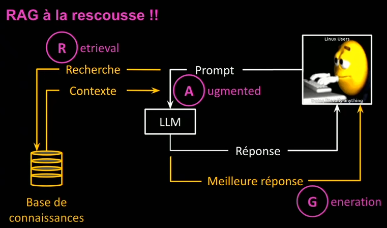

# 📚 PDF to Vectorized Environment with LLM Integration


## Introduction

Ce projet est conçu pour **vecteuriser** des documents PDF en utilisant des techniques avancées de traitement du langage naturel et les intégrer dans un modèle de langage de grande taille (LLM) pour fournir un système de questions-réponses basé sur les données stockées. Nous utilisons des technologies comme **ChromaDB** pour stocker les vecteurs, et **LlamaCpp** pour le traitement des requêtes avec des LLM.

L'objectif principal de ce projet est d'implémenter une solution de **retrieval-augmented generation (RAG)** qui utilise des documents PDF, les transforme en vecteurs de manière efficace, puis utilise un LLM pour répondre aux questions en se basant sur ces documents.

---

## Objectif du Projet

L'objectif principal de ce projet est de créer une infrastructure capable de :
1. Charger des documents PDF, les traiter et les découper en petits morceaux pour une meilleure compréhension.
2. Créer un système de vecteurs à partir de ces documents en utilisant des embeddings (représentations vectorielles).
3. Intégrer ces vecteurs dans un **système de stockage persistant** avec ChromaDB.
4. Utiliser un **modèle de langage de grande taille (LLM)** pour répondre aux questions en se basant sur les données stockées sous forme de vecteurs.
5. Fournir un système en boucle qui accepte des requêtes utilisateur et génère des réponses en temps réel.

---

## Approche Technique

### 1. Chargement et Découpage du PDF
La première étape du processus consiste à charger un document PDF à l'aide de **PyMuPDFLoader** et à le diviser en petits morceaux de texte en utilisant la méthode **RecursiveCharacterTextSplitter**. Cette technique permet de diviser les documents en segments de taille optimale pour la création d'embeddings.

### 2. Création des Embeddings
Pour chaque segment de texte, nous utilisons les **embeddings de Sentence Transformer (SBERT)** avec le modèle `all-MiniLM-L6-v2` pour convertir le texte en représentations vectorielles qui peuvent être utilisées par le modèle LLM pour rechercher et récupérer des informations pertinentes.

### 3. Stockage dans ChromaDB
Les représentations vectorielles sont ensuite stockées dans une base de données vectorielle persistante, **ChromaDB**, qui permet de stocker et de gérer efficacement de grands ensembles de vecteurs.

### 4. Utilisation de LlamaCpp
Le projet utilise le modèle de langage **LlamaCpp**, qui est un modèle léger de type LLM. Ce modèle est chargé avec des poids de LLaMA pour traiter les requêtes des utilisateurs et fournir des réponses en se basant sur les vecteurs stockés dans ChromaDB.

### 5. Système de Questions-Réponses
En utilisant **Retrieval Augmented Generation (RAG)**, nous mettons en place un système de questions-réponses. Lorsqu'une requête est envoyée par l'utilisateur, le système récupère les segments de texte pertinents à partir des vecteurs stockés, puis utilise le modèle Llama pour générer une réponse basée sur ces informations.

---

## Méthodes et Technologies Utilisées

### Méthodes :
- **Vectorisation des documents** : Transformation des segments de texte en représentations vectorielles.
- **Découpage de texte** : Utilisation de la technique de **RecursiveCharacterTextSplitter** pour découper efficacement les documents en morceaux gérables.
- **Système de questions-réponses** : Application du modèle RAG pour la génération de réponses basées sur des données stockées.

### Technologies :
- **ChromaDB** : Une base de données vectorielle utilisée pour stocker et récupérer les représentations vectorielles.
- **LangChain** : Une bibliothèque puissante pour la création de chaînes de traitement du langage, utilisée ici pour gérer le stockage des vecteurs et les chaînes de récupération.
- **LlamaCpp** : Un modèle de langage de grande taille (LLM) utilisé pour générer des réponses aux questions en fonction des informations stockées.
- **PyMuPDFLoader** : Un outil pour charger et lire les fichiers PDF.
- **Sentence Transformers** : Utilisé pour générer des embeddings textuels à partir de segments de texte découpés.

---

## Fonctionnalités

1. **Stockage de PDF en vecteurs** : Le projet permet de charger des fichiers PDF et de les transformer en vecteurs, prêts à être utilisés dans un système de récupération d'informations.
2. **Modèle de génération de réponses** : Utilisation de **LlamaCpp** pour traiter les requêtes et générer des réponses basées sur les vecteurs stockés.
3. **Télécharger le Modèle et Préparer les Données** 
- Téléchargez le modèle Llama depuis  [Hugging Face](https://huggingface.co/TheBloke/Llama-2-7B-Chat-GGML) et placez-le dans le répertoire model/.
- Placez les fichiers PDF que vous souhaitez analyser dans le répertoire data/, par exemple data/SENE_2023_archivage.pdf.


3. **Système en boucle** : Le projet inclut une boucle continue qui accepte des requêtes de l'utilisateur et génère des réponses en temps réel.

---

## Conclusion

Ce projet est une implémentation complète d'un système de **retrieval-augmented generation** (RAG), en utilisant des techniques avancées de traitement du langage naturel et des technologies comme **ChromaDB** et **LlamaCpp**. Il est conçu pour être évolutif et permet d'intégrer facilement de nouveaux documents à analyser et à interroger. Cette infrastructure est idéale pour des cas d'utilisation tels que la gestion de documents, les systèmes de support client intelligents, ou toute autre application nécessitant des systèmes de questions-réponses basés sur des documents.

---

## Instructions d'Exécution

1. Installer les dépendances nécessaires :
    ```bash
    pip install chromadb langchain sentence-transformers pymupdf
    ```

2. Assurez-vous que le modèle et les fichiers PDF sont bien placés dans les répertoires spécifiés.

3. Exécutez le fichier Python pour démarrer le système de question-réponse :
    ```bash
    python main.py
    ```

---

## Contact

Pour toute question ou collaboration, n'hésitez pas à me contacter :
- 📧 Email : [votre.email@example.com](mailto:votre.email@example.com)
- 🔗 LinkedIn : [Votre LinkedIn](https://linkedin.com)
- 🐱 GitHub : [Votre GitHub](https://github.com)
